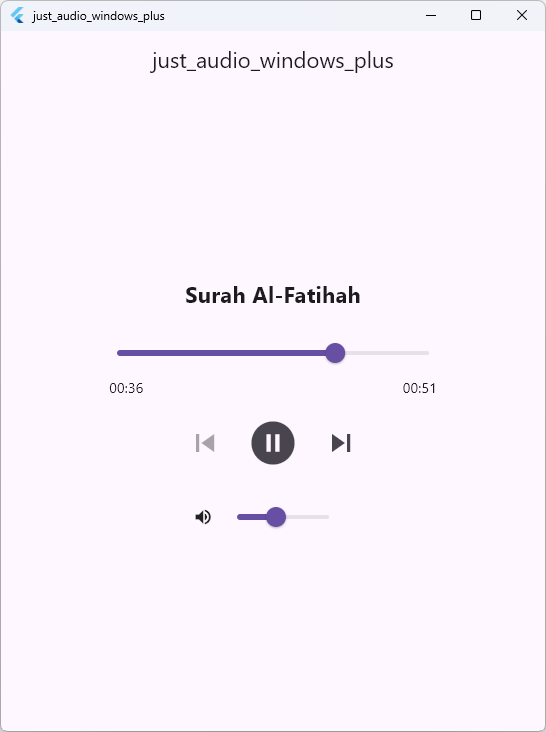

<div align="center">

# just_audio_windows_plus

### Production-Grade Native Windows Audio Engine for Flutter

[](https://pub.dev/packages/just_audio_windows_plus)
[](https://pub.dev/packages/just_audio_windows_plus/score)
[](https://github.com/OmarAfifi-CSE/just_audio_windows_plus/actions/workflows/ci.yml)
[](test/README.md)
[](https://en.cppreference.com/w/cpp/20)
[-0078D7?style=flat-square)](https://flutter.dev)
[](LICENSE)

<p align="center">
  <b>Seamless, crash-free, high-fidelity audio playback for Flutter desktop applications.</b><br>
  Built on native Windows Media Foundation (WinRT) with an ultra-reliable C++20 core and complete drop-in compatibility with <a href="https://pub.dev/packages/just_audio">just_audio</a>.
</p>

<p align="center">
  <a href="#-why-just_audio_windows_plus"><b>Why This Package?</b></a> •
  <a href="#-architectural-comparison"><b>Comparison</b></a> •
  <a href="#-quickstart-30-seconds"><b>Quickstart</b></a> •
  <a href="#-ready-to-copy-player-widget"><b>Ready Widget</b></a> •
  <a href="#-practical-recipes"><b>Code Recipes</b></a> •
  <a href="#-under-the-hood-built-for-desktop-reliability"><b>Under the Hood</b></a> •
  <a href="#-frequently-asked-questions-faq"><b>FAQ</b></a>
</p>

<p align="center">
  
</p>

</div>

---

## ⚡ Why `just_audio_windows_plus`?

Building desktop audio on Windows has notoriously tricky edge cases: WinRT background threadpool callbacks, asynchronous COM item lifetimes, and memory race conditions during fast disposal or page switches. 

The existing `just_audio_windows` (v0.2.3) implementation suffered from unhandled thread warnings, access violation crashes (`0xC0000005`), infinite hanging loads on 404s, and broken playlist looping.

`just_audio_windows_plus` was re-engineered from the ground up to provide an uncompromising, rock-solid native foundation:

- 🚀 **Zero External Dependencies**: Powered directly by native Windows Media Foundation (`WinRT Windows.Media.Playback.MediaPlayer`). Zero third-party DLLs to bundle, zero FFmpeg dependencies, and zero external installers required.
- 🧵 **Zero Platform Thread Warnings**: All background WinRT callbacks are safely marshalled onto Flutter's UI platform thread through a dedicated Win32 message window (`HWND_MESSAGE`). No dropped callbacks, no engine warnings.
- 🛡️ **Bulletproof Lifecycle & Disposal**: Native callbacks utilize `std::weak_ptr` with atomic generation tracking. Disposing of a player mid-playback, fast page switching, or triggering hot restart never causes native crashes.
- 🎯 **Strict `just_audio` Contract Compliance**: `await player.setFilePath(...)` resolves with the exact microsecond duration or throws a catchable `PlayerException` on missing files / 404s (no infinite hangs). `await player.play()` stays active until pause or completion.
- 🔀 **True Playlist & Shuffle Architecture**: Native recursive source tree supports nested concatenating, looping, and clipping sources with $O(N)$ permutation-safe shuffling and dynamic mutations (even starting from an empty playlist).
- 🧪 **133 Automated Verification Tests**: Verified by **26 real Windows end-to-end playback integration scenarios** (both Debug and Release), **39 native C++ unit tests**, and **68 Dart contract tests** running in automated CI.

---

## 🏛️ Architectural Comparison

See how `just_audio_windows_plus` compares to `just_audio_windows` (0.2.3):

| Capability / Reliability Dimension | `just_audio_windows` (0.2.3) | `just_audio_windows_plus` (0.5.3) |
|---|:---:|:---:|
| **Platform Thread Marshalling** | ❌ Background Threadpool (Engine logs non-platform thread warnings) | ✅ **Win32 Message Window (`HWND_MESSAGE`) serialization** |
| **C++ Toolchain Standard** | ❌ C++17 (Breaks on modern MSVC 14.51 / VS 2026 `STL1011`) | ✅ **Modern C++20 Core (Clean `/W4 /WX` on VS 2026)** |
| **Callback Lifetime & Teardown** | ❌ Raw `this` captured in WinRT handlers (Fatal `0xC0000005` on disposal) | ✅ **`std::weak_ptr` + Generation Token validation** |
| **Failed Load Resolution** | ❌ Returns premature success; pending loads hang forever on 404 | ✅ **Settles immediately with exact duration or `PlayerException`** |
| **`await play()` Semantics** | ❌ Returns prematurely after ~12 ms before track plays | ✅ **Resolves upon pause or end-of-file per `just_audio` contract** |
| **Full Playlist Looping (`LoopMode.all`)** | ❌ Repeats track 1 indefinitely when set before load | ✅ **`ApplyModes()` guarantees complete playlist cycling** |
| **Nested Audio Sources** | ❌ Rejects nested concatenating & looping sources with corrupt errors | ✅ **Recursive Source Tree model with ID-targeted mutations** |
| **Dynamic Playlist Insertion** | ❌ Adding items to an initially empty playlist remains silent | ✅ **Automatically attaches WinRT source upon first insertion** |
| **Playlist Shuffling Engine** | ❌ $O(N^2)$ erase-insert loop that corrupts track indices | ✅ **$O(N)$ Permutation-safe mapping (`native_utils.hpp`)** |
| **Live Buffering Clamping** | ❌ Unchecked float (`NaN`/`Inf` crashes Dart assertions) | ✅ **Guarded `ClampBufferedPosition` with `std::isfinite`** |
| **Native Error Text Integrity** | ❌ Temporary `c_str()` dangling pointer (`FormatException`) | ✅ **Owned `ArgumentError` strings preserve UTF-8 text** |
| **System Media Transport Controls** | ❌ Automatically hijacks OS lockscreen with blank overlays | ✅ **De-conflicted SMTC (Integrate cleanly with `audio_service`)** |
| **Multi-Engine Isolation** | ❌ Namespace globals share state across Flutter engines | ✅ **Instance-scoped players and dispatchers** |
| **Windows Playback Verification** | ❌ None (Only mock channel handlers) | ✅ **26 Real Playback Scenarios + 39 C++ Tests + 68 Dart Tests** |
| **Restart from Completed State** | ❌ Engine parks in `completed` after EOF; replaying the same source stays silent until a fresh source load | ✅ **`completed → ready` re-arm + one-shot event retry + self-healing full-state re-broadcast (converging delivery)** |

---

## 🚀 Quickstart (30 Seconds)

### 1. Add Dependencies

Add `just_audio` and `just_audio_windows_plus` to your `pubspec.yaml`:

```yaml
dependencies:
  flutter:
    sdk: flutter
  just_audio: ^0.10.6
  just_audio_windows_plus: ^0.5.3
```

> [!TIP]
> **Zero Platform Configuration Needed:** Flutter automatically detects and registers `just_audio_windows_plus` on Windows. You can use standard [`just_audio`](https://pub.dev/packages/just_audio) APIs without any platform-conditional boilerplate!

### 2. Basic Playback Example

```dart
import 'package:flutter/material.dart';
import 'package:just_audio/just_audio.dart';

void main() async {
  WidgetsFlutterBinding.ensureInitialized();

  final player = AudioPlayer();
  try {
    // Stream remote HTTP/HTTPS audio, play local files, or bundled assets
    await player.setUrl('https://server10.mp3quran.net/minsh/001.mp3');
    
    // Play until user pauses or track finishes
    await player.play();
  } finally {
    await player.dispose();
  }
}
```

---

## 📦 Complete Ready-to-Copy Player Widget

Here is a full, production-ready desktop audio bar widget featuring an interactive seek slider, real-time position/duration timestamps (`01:23 / 03:45`), buffering spinner, and play/pause controls:

```dart
import 'package:flutter/material.dart';
import 'package:just_audio/just_audio.dart';

/// A production-ready desktop audio player bar widget.
class DesktopAudioBar extends StatelessWidget {
  final AudioPlayer player;

  const DesktopAudioBar({super.key, required this.player});

  String _formatDuration(Duration? d) {
    if (d == null) return '--:--';
    final minutes = d.inMinutes.remainder(60).toString().padLeft(2, '0');
    final seconds = d.inSeconds.remainder(60).toString().padLeft(2, '0');
    return '$minutes:$seconds';
  }

  @override
  Widget build(BuildContext context) {
    final theme = Theme.of(context);

    return Card(
      elevation: 2,
      shape: RoundedRectangleBorder(borderRadius: BorderRadius.circular(16)),
      child: Padding(
        padding: const EdgeInsets.symmetric(horizontal: 16, vertical: 10),
        child: StreamBuilder<Duration?>(
          stream: player.durationStream,
          builder: (context, durationSnapshot) {
            final duration = durationSnapshot.data ?? Duration.zero;

            return StreamBuilder<Duration>(
              stream: player.positionStream,
              builder: (context, positionSnapshot) {
                var position = positionSnapshot.data ?? Duration.zero;
                if (position > duration) position = duration;

                return Row(
                  children: [
                    // Play / Pause / Buffering Indicator
                    StreamBuilder<PlayerState>(
                      stream: player.playerStateStream,
                      builder: (context, snapshot) {
                        final isPlaying = snapshot.data?.playing ?? false;
                        final processingState = snapshot.data?.processingState;
                        final isBusy = processingState == ProcessingState.loading ||
                            processingState == ProcessingState.buffering;

                        if (isBusy) {
                          return const Padding(
                            padding: EdgeInsets.all(8.0),
                            child: SizedBox(
                              width: 32,
                              height: 32,
                              child: CircularProgressIndicator(strokeWidth: 2.5),
                            ),
                          );
                        }

                        return IconButton(
                          icon: Icon(
                            isPlaying ? Icons.pause_circle_filled : Icons.play_circle_filled,
                            color: theme.colorScheme.primary,
                          ),
                          iconSize: 44,
                          tooltip: isPlaying ? 'Pause' : 'Play',
                          onPressed: () => isPlaying ? player.pause() : player.play(),
                        );
                      },
                    ),
                    const SizedBox(width: 12),

                    // Current Position
                    Text(
                      _formatDuration(position),
                      style: const TextStyle(fontWeight: FontWeight.w600),
                    ),
                    const SizedBox(width: 8),

                    // Interactive Seek Scrubber
                    Expanded(
                      child: Slider(
                        min: 0.0,
                        max: duration.inMilliseconds.toDouble(),
                        value: position.inMilliseconds.toDouble().clamp(
                              0.0,
                              duration.inMilliseconds.toDouble(),
                            ),
                        onChanged: (value) {
                          player.seek(Duration(milliseconds: value.round()));
                        },
                      ),
                    ),
                    const SizedBox(width: 8),

                    // Total Duration
                    Text(
                      _formatDuration(duration),
                      style: const TextStyle(fontWeight: FontWeight.w600),
                    ),
                  ],
                );
              },
            );
          },
        ),
      ),
    );
  }
}
```

---

## 💡 Practical Recipes

### 1. Local Audio Files & Bundled Assets

```dart
// Local file paths (Windows paths with spaces and Unicode are safely handled)
await player.setFilePath(r'C:\Audio\Recordings\01 Surah Al-Fatihah.mp3');

// Bundled Flutter assets (declared under flutter.assets in pubspec.yaml)
await player.setAsset('assets/audio/notification.mp3');
```

### 2. Seamless Playlists, Looping & Shuffle

```dart
// Build a playlist
final playlist = ConcatenatingAudioSource(children: [
  AudioSource.uri(Uri.parse('https://server10.mp3quran.net/minsh/001.mp3')),
  AudioSource.uri(Uri.parse('https://server10.mp3quran.net/minsh/112.mp3')),
  AudioSource.uri(Uri.parse('https://server10.mp3quran.net/minsh/113.mp3')),
  AudioSource.uri(Uri.parse('https://server10.mp3quran.net/minsh/114.mp3')),
]);

await player.setAudioSource(playlist, initialIndex: 0);

// Loop modes: LoopMode.off, LoopMode.one (repeat track), LoopMode.all (repeat playlist)
await player.setLoopMode(LoopMode.all);

// Enable randomized playback with permutation safety
await player.setShuffleModeEnabled(true);

// Next / Previous navigation
await player.seekToNext();
await player.seekToPrevious();

// Dynamic mutations: add or remove items at runtime
await playlist.add(AudioSource.uri(Uri.parse('https://server10.mp3quran.net/minsh/110.mp3')));
```

### 3. Volume, Speed & Seeking

```dart
// Volume: 0.0 (silent) to 1.0 (maximum)
await player.setVolume(0.85);

// Variable playback speed: e.g. 0.75x, 1.25x, 1.5x, 2.0x
await player.setSpeed(1.25);

// Seek by time or playlist track index
await player.seek(const Duration(minutes: 1, seconds: 30));
await player.seek(Duration.zero, index: 2); // Jump directly to track 2
```

### 4. Robust Error Handling

```dart
try {
  await player.setUrl('https://example.invalid/audio.mp3');
} on PlayerException catch (e) {
  // Immediately catches 404 Not Found, unsupported codecs, or missing native files
  debugPrint('Native load failed with code: ${e.code}, message: ${e.message}');
}

// Listen for background decoding errors or network stream dropouts
player.errorStream.listen((error) {
  debugPrint('Asynchronous playback error: $error');
});
```

---

## 🔬 Under the Hood: Built for Desktop Reliability

Developing audio on Windows desktop requires interfacing directly with COM and WinRT Media Foundation. `just_audio_windows_plus` is designed with strict engineering governance:

1. **Win32 Message-Only Window Dispatcher (`platform_thread.hpp`)**:
   WinRT fires media notifications on background ThreadPool threads. Writing directly to Flutter's binary messenger from background threads violates Flutter's threading model and causes dropped events. We marshal every event through an `HWND_MESSAGE` Win32 message window, ensuring 100% of event callbacks execute cleanly on Flutter's UI platform thread.

2. **Weak Ownership & Atomic Generation Tokens (`player.hpp`)**:
   `AudioPlayer` extends `std::enable_shared_from_this<AudioPlayer>`. Native callbacks capture a `std::weak_ptr<AudioPlayer>` paired with an atomic `generation_` counter. If the player is disposed while WinRT callbacks are in-flight, they expire harmlessly without touching freed memory.

3. **Permutation-Safe Playlist Shuffling (`native_utils.hpp`)**:
   Instead of destructive in-place random shifting, `just_audio_windows_plus` implements a strict $O(N)$ permutation mapping (`ReorderByShuffleOrder`). It asserts that the shuffle order is a true mathematical permutation without duplicates or out-of-bounds indices, synchronizing cleanly with WinRT's `SetShuffledItems`.

4. **Floating-Point NaN & Infinity Shielding**:
   All volume, speed, and buffering inputs/outputs are guarded by `std::isfinite` and `ClampBufferedPosition`, preventing corrupt float values from crashing Dart's runtime assertions during live streaming.

5. **Clean System Media Transport Controls (SMTC) Separation**:
   By explicitly disabling WinRT's automatic command manager (`mediaPlayer.CommandManager().IsEnabled(false)`), `just_audio_windows_plus` prevents blank OS lockscreen overlays and allows applications to manage hardware keyboard media keys seamlessly via [`audio_service`](https://pub.dev/packages/audio_service).

---

## 🧪 Comprehensive Verification & Quality Gates

Every capability in this package is proven by automated tests. We believe in **evidence over assertions**:

```powershell
# 1. Run full Dart contract suite (68 tests)
flutter test

# 2. Run native C++ source tree and dispatcher unit tests (39 tests)
powershell -ExecutionPolicy Bypass tool/test_native.ps1

# 3. Run real Windows playback regression suite against the compiled plugin (26 scenarios)
powershell -ExecutionPolicy Bypass tool/test_windows.ps1 -Mode debug
powershell -ExecutionPolicy Bypass tool/test_windows.ps1 -Mode release
```

### Summary of Verified Scenarios:
- **Exact Microsecond Duration**: Asserts 3-second WAV fixture returns exact 3000ms duration from `load`.
- **Missing Files & HTTP 404**: Asserts immediate resolution with `PlayerException` (no hanging Futures).
- **`play()` Completion Semantics**: Asserts Future completes at pause or EOF; preserves `playing=true`.
- **Full Playlist Looping**: Asserts exact track progression `0 → 1 → 0` under `LoopMode.all`.
- **Deterministic Shuffle**: Asserts custom shuffle sequence `0 → 2 → 1` in automatic playback.
- **Cross-Item Seeking**: Asserts seeking to a non-zero position across different items preserves exact timeline offset.
- **Dynamic Playlist Insertion**: Asserts adding items to an initially empty playlist attaches source and plays.
- **Nested Source Trees**: Concatenating within concatenating, finite looping expansion, and ID mutations.
- **Disposal Under Heavy Stress**: Rapid create/load/seek/dispose iterations with callbacks in-flight without crash.
- **Concurrent Independent Players**: Multiple simultaneous players running concurrently without cross-talk.

*(See [test/README.md](test/README.md) for full instructions and coverage scope)*.

---

## ❓ Frequently Asked Questions (FAQ)

#### Q: Do users need to install external runtimes, FFmpeg, or codecs?
**No.** `just_audio_windows_plus` relies on Windows Media Foundation (`WinRT Windows.Media.Playback.MediaPlayer`), which is pre-installed on every Windows 10 and 11 machine. It compiles directly into your Flutter executable with zero external runtime requirements.

#### Q: What audio formats are supported?
All standard formats supported natively by Windows Media Foundation on the user's system: MP3, AAC, WAV, FLAC, M4A, WMA, as well as HTTP/HTTPS, HLS, and DASH streams. Format support follows the media codecs available on the host Windows installation.

#### Q: Can I run multiple `AudioPlayer` instances simultaneously?
**Yes.** All state, method channels, and event sinks are strictly isolated per player instance. You can run multiple players simultaneously (e.g. background music + voice-over) with zero interference.

#### Q: How do I handle background audio or keyboard media keys?
Because `just_audio_windows_plus` cleanly disables automatic WinRT SMTC hijacking, you can use [`audio_service`](https://pub.dev/packages/audio_service) to manage OS lockscreen widgets and keyboard media keys with total control.

#### Q: Can I pass custom HTTP headers with audio URLs?
Direct native URL playback in WinRT does not support custom request headers. For audio sources requiring authentication tokens or custom headers, route them through `just_audio`'s built-in local HTTP proxy (`AudioSource.uri(uri, headers: {...})`).

#### Q: Why do `setPitch` and `setSkipSilence` return errors?
WinRT's native media player does not support independent pitch shifting or silence skipping in this architecture. Rather than silently pretending to succeed, the engine follows a fail-fast design and returns an explicit `unsupported` error for non-default values.

---

## 📜 Author & License

- Engineered, hardened, and maintained by [Omar Afifi](https://omar-afifi.com/) ([@OmarAfifi-CSE](https://github.com/OmarAfifi-CSE)).
- Foundational architectural heritage credited to **Bruno D'Luka** and **Ryan Heise**.
- Licensed under the **MIT License**. See [LICENSE](LICENSE) for details.
